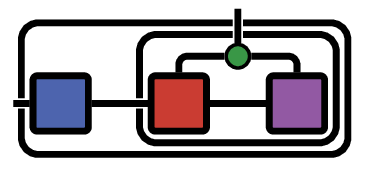

<!-- # OMEinsum -->
<div align="center"> </img>
<h1>OMEinsum - One More Einsum</h1>
</div>

[](https://under-Peter.github.io/OMEinsum.jl/stable)
[](https://under-Peter.github.io/OMEinsum.jl/dev)
[](https://travis-ci.com/under-Peter/OMEinsum.jl)
[](https://ci.appveyor.com/project/under-Peter/OMEinsum-jl)
[](https://codecov.io/gh/under-Peter/OMEinsum.jl)

This is a repository for the _Google Summer of Code_ project on Differentiable Tensor Networks.
It is a work in progress and will **change substantially this summer (2019)** - no guarantees can be made.

This package exports one function, `einsum`, with three interfaces.
`einsum` implements functionality similar to the `einsum` function in `numpy`,
although some details are different.

`einsum` operations are specified by a tuple of tensors `xs = (x1, x2, x3...)`
, a tuple of index-labels for the tensors in `xs`, `ixs = (ix1, ix2, ix3...)`,
and output index-labels `iy` specified as `einsum(EinCode(ixs,iy), xs)`.
Alternatively, operations can be specified using the `@ein`-macro or
the `@ein_str`- string literal (see examples or help).

Let `l` be the set of all unique labels in the `ixs` without the ones in `iy`.
`einsum` then calculates an output tensor `y` with indices labelled `iy` according
to the following specification:
```
∀ iy : y[iy] = ∑ₗ x1[ix1] * x2[ix2] * x3[ix3] ...
```
where the sum over `l` implies the sum over all possible values of the labels in `l`.

To find out the details about einsum, check out my [nextjournal-article](https://nextjournal.com/under-Peter/julia-summer-of-einsum) or the [numpy-manual](https://docs.scipy.org/doc/numpy/reference/generated/numpy.einsum.html).


[Benchmarks are available here](https://github.com/under-Peter/OMEinsum-Benchmarks)

## Examples
Consider multiplying two matrices `a` and `b` which we specify with
```julia
julia> a, b = rand(2,2), rand(2,2);

julia> einsum(EinCode((('i','k'),('k','j')),('i','j')),(a,b))
```

This way of specifying an operation is prone to errors,
which is why additional interfaces are exported.

The [string literal](https://docs.julialang.org/en/latest/manual/metaprogramming/#Non-Standard-String-Literals-1) does not introduce any runtime overhead thanks to Julia's powerful meta programming and simplifies the above operation to
```julia
julia> ein"ik,kj -> ij"(a,b)
```

Instead of the string-literal, we can also use the `@ein` macro,
which is closer to the standard way of writing einsum-operations in physics
as
```julia
julia> @ein c[i,j] := a[i,k] * b[k,j];
```
which will calculate the matrix product between `a` and `b` _and_ assign
it to a new variable `c`.
So this is equivalent to writing
```julia
julia> c = ein"ik,kj -> ij"(a,b);
```


If we're interested in the sum of all elements of a matrix product `a*b`
we can reduce over all indices with the specification `ij,jk -> `
```julia
julia> ein"ij,jk->"(a,b)[] ≈ sum(a * b)
true
```

Note the use of `[]` to extract the element of a 0-dimensional array.
`einsum` always returns arrays so scalars are wrapped in 0-dimensional arrays.


## Contribute

Suggestions and Comments in the _Issues_ are welcome.

## License
MIT License
