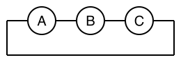

# Basic Usage

In the following example, we demonstrate the einsum notation for basic tensor operations.

## Einsum notation
To specify the operation, the user can either use the [`@ein_str`](@ref)-string literal or the [`EinCode`](@ref) object.
For example, both the following code snippets define the matrix multiplication operation:
```@repl intro
using OMEinsum
code1 = ein"ij,jk -> ik"  # the string literal
ixs = [[1, 2], [2, 3]]  # the input indices
iy = [1, 3]  # the output indices
EinCode(ixs, iy)  # the EinCode object (equivalent to the string literal)
```

## Examples
We first define the tensors and then demonstrate the einsum notation for various tensor operations.
```@repl tensor
using OMEinsum
s = fill(1)  # scalar
w, v = [1, 2], [4, 5];  # vectors
A, B = [1 2; 3 4], [5 6; 7 8]; # matrices
T1, T2 = reshape(1:8, 2, 2, 2), reshape(9:16, 2, 2, 2); # 3D tensor
```
### Unary examples
```@repl tensor
ein"i->"(w)  # sum of the elements of a vector.
ein"ij->i"(A)  # sum of the rows of a matrix.
ein"ii->"(A)  # sum of the diagonal elements of a matrix, i.e., the trace.
ein"ij->"(A)  # sum of the elements of a matrix.
ein"i->ii"(w)  # create a diagonal matrix.
ein"i->ij"(w; size_info=Dict('j'=>2))  # repeat a vector to form a matrix.
ein"ijk->ikj"(T1)  # permute the dimensions of a tensor.
```

### Binary examples
```@repl tensor
ein"ij, jk -> ik"(A, B)  # matrix multiplication.
ein"ijb,jkb->ikb"(T1, T2)  # batch matrix multiplication.
ein"ij,ij->ij"(A, B)  # element-wise multiplication.
ein"ij,ij->"(A, B)  # sum of the element-wise multiplication.
ein"ij,->ij"(A, s)  # element-wise multiplication by a scalar.
```

### Nary examples
```@repl tensor
optein"ai,aj,ak->ijk"(A, A, B)  # star contraction.
optein"ia,ajb,bkc,cld,dm->ijklm"(A, T1, T2, T1, A)  # tensor train contraction.
```

## Application: Trace under cyclic permutation
!!! note "Example: Trace under cyclic permutation"
    Consider 3 matrices $A, B, C$ and the cyclic permutation of the trace $\text{Tr}(ABC)$. The trace of a product of matrices is invariant under cyclic permutations, i.e., $\text{Tr}(ABC) = \text{Tr}(CAB) = \text{Tr}(BCA)$. This can be verified using the einsum diagram.

    

    ```@repl tensor
    A, B, C = (randn(2, 2) for i=1:3)
    optein"ij,jk,ik->"(A, B, C) ≈ optein"jk,ik,ij->"(B, C, A)
    optein"ij,jk,ik->"(A, B, C) ≈ optein"ik,ij,jk->"(C, A, B)
    ```