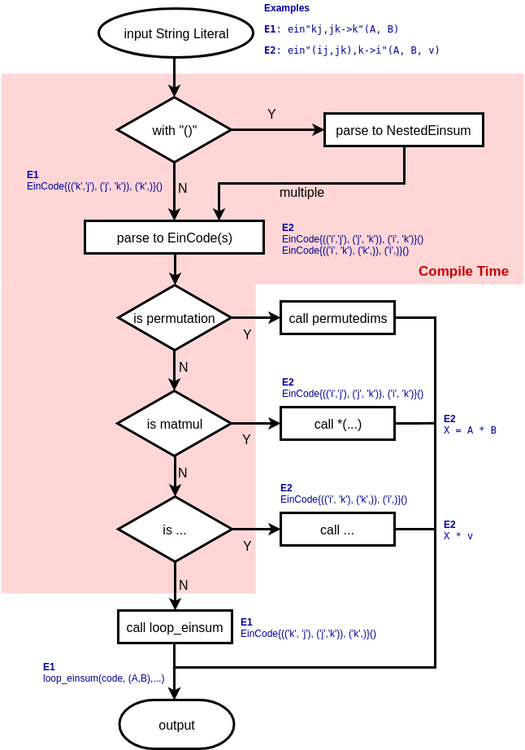

# OMEinsum.jl

This package exports one function, `einsum`, with three interfaces.
`einsum` implements functionality similar to the `einsum` function in `numpy`,
although some details are different.

`einsum` operations are specified by a tuple of tensors `xs = (x1, x2, x3...)`
, a tuple of index-labels for the tensors in `xs`, `ixs = (ix1, ix2, ix3...)`,
and output index-labels `iy` specified as `einsum(EinCode(ixs,iy), xs)`.
Alternatively, operations can be specified using the `@ein`-macro or
the `@ein_str`- string literal (see examples or help).

Let `l` be the set of all unique labels in the `ixs` without the ones in `iy`.
`einsum` then calculates an output tensor `y` with indices labelled `iy` according
to the following specification:
```math
\forall iy : y[iy] = \sum_l x_1[ix_1] * x_2[ix_2] * x_3[ix_3] \ldots
```

where the sum over `l` implies the sum over all possible values of the labels in `l`.

The structure of an `einsum` evaluation with the string-literal is depicted
in the flowchart below:

